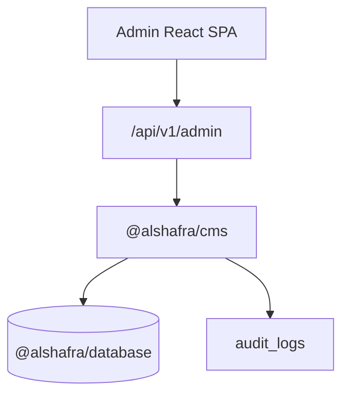

# 01 — Admin Architecture

Modular monolith composition root: `apps/admin`.

- UI: `apps/admin/src` (React, RTL, light/dark)
- HTTP: `handleAdminApi` in `@alshafra/cms` (in-process, not a microservice)
- Vite middleware in `apps/admin/server` (Node only)

