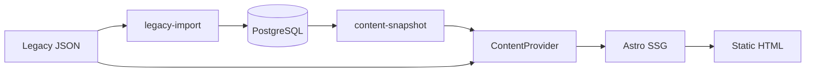

# 01 — Database Overview

## Engine

PostgreSQL 15+ via Supabase in staging/production. Local tests: PGlite executing the same SQL.

## Access

Only `@alshafra/database` opens SQL. Apps do not construct Supabase clients in the browser. `SUPABASE_SERVICE_ROLE_KEY` is server-only (ADR-401).

No Prisma. Migrations are versioned SQL + Zod row schemas (Phase 1 technology stack).

## Naming

Plural `snake_case` tables, `id` UUID PKs (UUIDv7 in app), `{singular}_id` FKs, `timestamptz` UTC, `*_json` for JSONB.

## Schemas

- `public` — application
- `auth` — Supabase-managed; domain `users.auth_user_id` links without duplicating passwords

## Static-first

Astro remains `output: 'static'`. Import runs at **build/tooling** time. Pages are not converted to per-request SSR in Phase 4.

