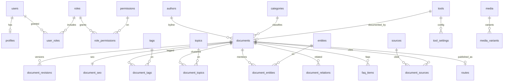

# 02 — Entity Model

Editorial supertype is **`documents`**. UGC uses separate tables (`questions`, `answers`, `comments`) so indexing/ads cannot leak.

Named real-world things live in **`entities`** (Phase 4) in addition to Phase 1 **`topics`** (editorial clusters).

Conflict vs Phase 4 wording `content_versions` / `content_tags` / `seo_metadata`: Phase 1 names win (`document_revisions`, `document_tags`, `document_seo`). See ADR-404.
