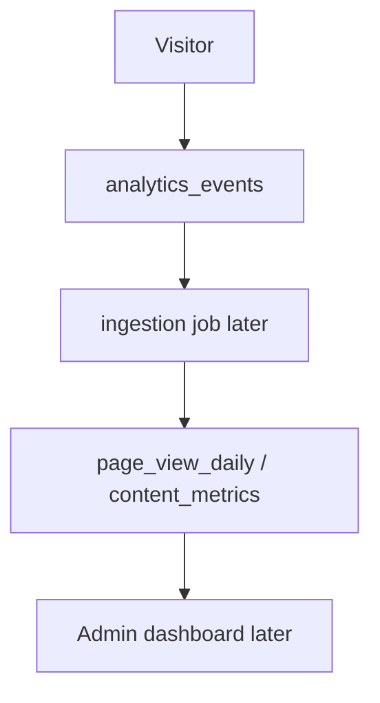

# 09 — Events

## Product analytics (allowlist)

`page_view`, `content_view`, `article_view`, `tool_used`, `search`, `share`, `copy_link`, `download`, `login`, `signup`, `social_click`, plus community names as **contracts only**: `question_created`, `answer_created`, `comment_created`.

Zod: `@alshafra/analytics` `analyticsEventContract`.

Beacon path later: `POST /api/v1/public/events` (not implemented in Phase 4).

## Domain events (Phase 1 §59)

`content.published`, `article.updated`, `user.created`, `social.publish.*`, `job.failed` — catalog remains valid. Transport is still in-process → `jobs` table later.

