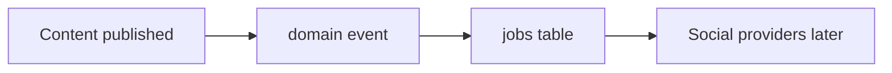

# 19 — Future Dashboard Data Model

**Not built in Phase 4.** Schema is shaped so an admin app can compose:

- Overview: counts from documents/tools/users + rollups
- Traffic: `page_view_daily`, `analytics_events`
- Content/Pages: `documents`, `routes`, `document_seo`
- Tools: `tools`, `tool_metrics`
- Users: `users`, `user_roles`
- Community: questions/answers/comments/reports (flag off)
- Social: social_posts / social_publish_jobs (flag off)
- Analytics: metrics tables — only filled when events are collected
- SEO: document_seo, redirects
- Media: media
- Jobs: jobs
- Settings / flags / audit / system health

Do not display invented traffic.
