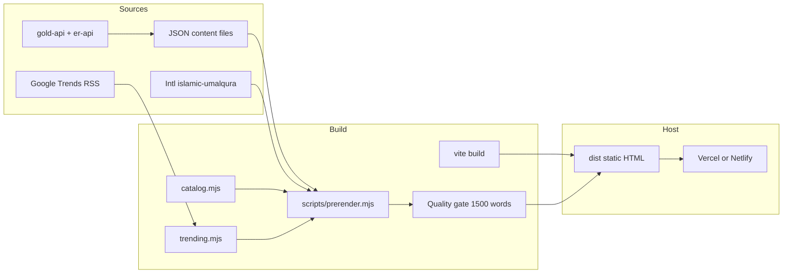

# 01 — Legacy Site Audit

**Scope:** Full reverse engineering of the current `alshafra` repository and the live site `https://alshafra.com` as of 2026-08-20.  
**Method:** Read-only inspection of source, data, build scripts, hosting config, existing internal reports, and a live fetch of `/` and `/robots.txt`.  
**Constraint:** No production code was modified.

---

## 1. What the current product is

The running product is **not** an empty scaffold and **not** yet the Alshafra platform described in the vision.

It is a **static-first Arabic SPA** that presents itself as:

> **تقويم السعودية** — بوابة المواعيد الرسمية

Primary jobs to be done today:

1. Tell a Saudi user **today’s Hijri and Gregorian date** (Riyadh / Umm Al-Qura).
2. Convert dates both ways.
3. Answer **when money arrives** (government salaries, Citizen Account, retirees, social security, housing support) with a weekend rule.
4. Show **school calendar** and **official holidays**.
5. Show **countdowns** (“كم باقي على…”).
6. Show **gold gram prices** and **USD rates** for 21 Arabic-speaking countries.
7. Publish a small set of **long editorial articles** and a larger set of **automated Gulf guides** under `/trending`.

Secondary / incomplete jobs:

- Name decoration tools exist in React but are **not prerendered**.
- A 16-language “Shafra Tools” catalog exists in code and is **mostly unpublished**.
- AdSense is wired but slots are gated off unless env vars are set.

---

## 2. Repository map

```
alshafra/
├── PROJECT.md                 # Internal architecture bible (Saudi calendar + later global catalog)
├── index.html                 # SPA shell + Organization/WebSite JSON-LD + AdSense + conflicting robots
├── package.json               # React 18, Vite 7, Tailwind 3, lucide-react only
├── vite.config.ts
├── vercel.json                # cleanUrls, no SPA fallback, 301 /index.html
├── netlify.toml               # 410 for old site + security headers
├── public/
│   ├── robots.txt
│   ├── _redirects             # Netlify 410
│   ├── ads.txt
│   ├── 404.html / 410.html
│   ├── published.json         # 127 live URLs (2026-08-20)
│   ├── og-image.jpg
│   ├── manifest.webmanifest
│   └── 4f9c2a7e…txt           # IndexNow key
├── scripts/
│   ├── prerender.mjs          # Static HTML + sitemap + quality gate ≥1500 words
│   ├── catalog.mjs            # Multilingual programmatic catalog
│   ├── countdowns.mjs         # Shared Umm Al-Qura engine for build
│   ├── trending.mjs           # /trending pages
│   ├── fetch-prices.mjs       # gold-api.com + open.er-api.com
│   ├── fetch-trending.mjs     # Google Trends RSS snapshot
│   └── indexnow.mjs           # Bing IndexNow
├── src/
│   ├── App.tsx                # Lazy pages + global vs Saudi split
│   ├── lib/router.ts          # Custom history router (no react-router)
│   ├── lib/seo.ts             # document.title / canonical / JSON-LD
│   ├── lib/hijri.ts           # ICU islamic-umalqura
│   ├── lib/events.ts          # salaries + Saudi events
│   ├── pages/*                # One file per major surface
│   └── data/*.json            # Content and datasets
└── .github/workflows/daily-publish.yml
```

There is **no** `src/api`, **no** database schema, **no** auth, **no** CMS, **no** tests, **no** Dockerfile.

---

## 3. Runtime architecture (as built)



**Request path today**

1. Crawler or first paint receives prerendered HTML inside `#root` (not `<noscript>`).
2. React hydrates and replaces the shell with the interactive app.
3. Client routing uses `history.pushState` + `alshafra:routechange`.
4. Unknown URLs are **not** rewritten to `index.html`. They should be real 404s.

This is a **prerendered SPA**, not SSR, not a CMS, not a modular monolith yet.

---

## 4. Tech stack (actual, not aspirational)

| Layer | Actual | Notes |
|---|---|---|
| UI | React 18.3 + TypeScript 5.5 | Only `lucide-react` as extra runtime dep |
| Bundler | Vite 7 | `npm run build` = `vite build && node scripts/prerender.mjs` |
| CSS | Tailwind 3, RTL, brand green | Fonts: IBM Plex Sans Arabic + Reem Kufi from Google Fonts |
| Router | Custom `src/lib/router.ts` | Pathname-based; 16 language prefixes |
| Data | Static JSON in `src/data` | Single source for React + prerender |
| Hijri | `Intl.DateTimeFormat('en-u-ca-islamic-umalqura-nu-latn')` | Tabular algorithm is fallback only |
| Prices | Daily GitHub Action | Free public APIs, no keys |
| Search | None | Schema.org `SearchAction` points to `/?q=` which does not search |
| Auth / DB | None | PROJECT.md mentions Supabase as “available unused” — **not present in code** |
| CMS | None | Articles are JSON |
| Community | None | |
| Queue | GitHub Actions cron 04:30/12:30/20:30 UTC | Commits generated JSON to `main` |
| Hosting | `vercel.json` + `netlify.toml` | Live DNS historically pointed at Vercel (see existing Aug 2026 report). **Needs verification today.** Target for the new platform is Cloudflare Pages. |

---

## 5. Identity split (critical product finding)

The site currently speaks with **three names**:

| Surface | Name |
|---|---|
| `SITE_NAME` in `src/lib/seo.ts`, homepage, header (Saudi pages), footer, manifest | **تقويم السعودية** |
| i18n `siteName` (`src/i18n/ar.json`) and gold/USD prerender titles | **شفرة تولز** |
| Domain | **alshafra.com** |

Gold/USD published titles use “شفرة تولز”. Saudi calendar pages use “تقويم السعودية”. Language switcher and footer advertise 16 languages.

This is already two products on one domain. Phase 0 treats this as a **brand migration problem**, not as proof that the calendar cluster is disposable.

---

## 6. Routing inventory (kinds)

From `parseRoute`:

**Saudi-priority Arabic routes**

`/`, `/salaries`, `/date-converter`, `/age-calculator`, `/hijri-calendar`, `/school-calendar`, `/holidays`, `/countdown`, `/countdown/:slug`, `/today`, `/faq`, `/articles`, `/articles/:slug`, `/world/:slug`, `/name-decoration`, `/name-decoration/:slug`, `/privacy`, `/terms`, `/about`, `/contact`, `/trending`, `/trending/today`, `/trending/{economy|technology|social|education|religion|travel}`, `/trending/:slug`

**Catalog Arabic routes**

`/gold-price`, `/gold-price/:country`, `/usd-rate`, `/usd-rate/:country`, `/date-today/:country`, `/fancy-letter/:slug`, `/name/:slug`, `/names/:list`, localized tool slugs (`zakhrafa-nusus`, `adawat`, …)

**Non-Arabic**

`/{lang}` plus the same catalog patterns. `/trending` on non-AR languages is forced to language hub.

**App.tsx split**

- “Global” kinds render `GlobalPage`.
- Saudi kinds render dedicated page components.
- `useSeo` sets **noindex** for most global kinds except Arabic gold/USD (quality-ready).

---

## 7. Published vs coded

| Class | Count | Source |
|---|---:|---|
| Published (sitemap / published.json) | **127** | All `lang=ar` |
| Editorial articles | 7 | `articles.json` |
| Countdown definitions | 18 + hub | `countdowns.json` |
| Trending topics | 35 + hub + 6 categories + today | `trending.json` |
| Gold countries | 21 + hub | Arabic countries in `countries.json` |
| USD countries | 21 + hub | same |
| Core tools/legal/home | 15 | prerender route table |
| Name decoration | 1 hub + 5 tools | **React only — missing from published.json** |
| Catalog remainder | thousands of potential URLs | unpublished by quality/schedule |

Exact URL table: `02-legacy-url-inventory.md`.

---

## 8. Content systems

### 8.1 Editorial articles (`src/data/articles.json`)

Seven reviewed guides (reviewed 2026-08-12), each with sections, FAQ, keywords, official sources:

| Slug | Category | Intent |
|---|---|---|
| `salary-dates-saudi-arabia` | salaries | Government payday table |
| `citizen-account-payment-dates` | salaries | Citizen Account day 10 |
| `hijri-calendar-1448` | calendar | Hijri 1448 |
| `school-calendar-1448` | calendar | School year 1448–1449 |
| `official-holidays-saudi-arabia` | holidays | Holidays by sector |
| `hijri-to-gregorian-conversion` | tools | Conversion explainer |
| `developed-social-security` | support | Social security eligibility |

These are the strongest **YMYL** pages. They must be preserved and kept factually tied to official sources.

### 8.2 Core guides (`core-guides.json`)

Long editorial asides injected into `/`, `/salaries`, `/hijri-calendar`, `/school-calendar`, `/holidays`, `/date-converter`, `/age-calculator`, `/today`, `/faq`, `/articles`, legal pages. This is how those pages pass the 1500-word prerender gate.

### 8.3 Countdowns

Schedule types: `hijri-annual`, `gregorian-annual`, `monthly` (+ weekend rule), `fixed`.

Slugs: `national-day`, `founding-day`, `ramadan`, `eid-fitr`, `eid-adha`, `laylat-alqadr`, `hijri-new-year`, `citizen-account`, `employee-salaries`, `retiree-salaries`, `social-security`, `school-start`, `fall-break`, `midyear-break`, `school-end`, `new-year`, `suhail`, `murabbaniya`.

### 8.4 Trending engine

35 long “Gulf guides” generated with shared padding sections (`reviewChecklist`, `categoryQualityGuide`). Unique intros/sections exist, but **boilerplate is large**. Treat as **early programmatic SEO**, not as 35 distinct editorial masterpieces.

### 8.5 Prices

`prices.json` updated 2026-08-20: `xauUsd = 4522.3`, 166 FX rates, source `gold-api.com + open.er-api.com`. Country pages compute 24K/22K/21K/18K locally. **Indicative, not a licensed quote.**

---

## 9. SEO implementation (current)

**Done well**

- Per-route title, description, canonical, OG, Twitter, JSON-LD in prerender.
- Sitemap generated from the same route table (cannot drift).
- Quality gate: prerender **throws** if visible `<main>` words < 1500.
- Orphan check (inbound links) at build.
- Related-links injector.
- `hreflang` prepared for catalog pages.
- BreadcrumbList uses a distinct `jsonLdId` (historical bug fixed).
- 404.html / 410.html with `noindex`.
- `ads.txt` present.
- IndexNow submission after daily build.
- `trailingSlash: false` on Vercel.

**Problems still in the tree**

| ID | Issue | Why it matters |
|---|---|---|
| S1 | `index.html` has `robots: noindex, follow` **and** `googlebot: index, follow` | Conflicting crawler signals on the SPA shell. Prerender overwrites robots on emitted pages, but the shell remains dangerous if ever served. |
| S2 | Schema `SearchAction` targets `/?q={search_term_string}` | There is no search. |
| S3 | `/name-decoration*` not prerendered | Linked from header/footer/homepage; likely **404** on hosts without SPA fallback. |
| S4 | Footer language links to `/{lang}` | Those hubs are mostly unpublished → internal 404s. |
| S5 | Homepage PDF CTA links to `/hijri-calendar` and does not download a PDF | Misleading UX / E-E-A-T. |
| S6 | Date converter copy still says conversion is “approximate” while `hijri.ts` uses ICU Umm Al-Qura | Trust inconsistency. |
| S7 | Brand tokens mixed (تقويم السعودية / شفرة تولز) | Dilutes entity SEO. |
| S8 | 410 rules live in Netlify files, **not** in `vercel.json` | If production is Vercel, old URLs may still 404 instead of 410 (better than 200, worse than 410). **Needs verification.** |
| S9 | AdSense script always loaded in `index.html` | Performance + policy; slots themselves are gated. |
| S10 | No GA / GSC verification tags in code | Measurement gap (also listed in the Aug 2026 internal audit). |
| S11 | Trending/gold/USD pages use heavy shared padding to hit 1500 words | Google may treat some as templated. |
| S12 | `changefreq: daily` on many evergreen guides | Sitemap noise. |

Older audits in `docs/` (3 Aug 2026) documented fatal issues that the current code claims to have fixed: noscript hiding, soft 404 catch-all, button-only nav, wrong Hijri engine, stale holidays. **Those fixes are present in source.** Whether Google has fully dropped the old identity is **NEEDS VERIFICATION**.

---

## 10. Security / privacy (current)

- No user accounts, no cookies of our own except third parties (AdSense / possible Analytics mentioned in privacy policy).
- Security headers in Netlify and Vercel: `nosniff`, `Referrer-Policy`, `Permissions-Policy` (camera/mic/geo disabled), HSTS.
- Contact is a public email only.
- Privacy/Terms exist and are prerendered.
- Upload surface: none.
- Secrets: none in repo except the **public** IndexNow key (by design) and AdSense pub id (by design).
- GitHub Action has `contents: write` and pushes to `main`.

---

## 11. Performance (current)

- Code splitting via `React.lazy` per page.
- Homepage `useNow(1000)` still re-renders the hero clock every second.
- Google Fonts (two families, many weights) loaded from `fonts.googleapis.com`.
- Single JS app after hydration — tools need JS; articles should not, but they still hydrate the full SPA.
- Images: almost none except `og-image.jpg` and SVG favicon. No R2, no image pipeline.
- Cache: HTML `max-age=0, s-maxage=3600, stale-while-revalidate=86400` on Vercel; assets immutable.

---

## 12. What must be preserved

1. All **127 published URLs** (keep path; upgrade content/IA).
2. Umm Al-Qura engine and Riyadh timezone rule.
3. Weekend disbursement rule (Friday→Thursday, Saturday→Sunday).
4. Editorial articles + official source links.
5. Countdown slug set.
6. Arabic gold/USD country URLs.
7. 410 intent for the previous tech site.
8. RTL, `ar-SA`, ads.txt, legal pages, IndexNow capability.
9. Quality-gate *idea* (do not ship thin HTML), not necessarily the current 1500-word padding tactic.

## 13. What must not be blindly preserved

1. Brand lock-in to “تقويم السعودية” on the homepage.
2. 16-language thin catalog.
3. Placeholder tool pages (`tool-placeholder` in catalog HTML).
4. Vite SPA as the long-term content architecture.
5. GitHub Action committing generated files to `main` as the only “CMS”.
6. Dual Vercel/Netlify config without a single production contract.
7. Indexing of UGC (none exists yet — keep it that way until a quality gate exists).

---

## 14. Existing documentation debt

The repo already contains Arabic operational reports:

- `docs/تقرير-فحص-شامل-alshafra-أغسطس-2026.md`
- `docs/تقرير-تحسين-محسنات-الموقع-alshafra.md`
- `docs/خريطة-الكلمات-المفتاحية-العالمية.md`
- `docs/خطة-10-الاف-زيارة-30-يوم.md`
- `PROJECT.md`

Those documents are **historical evidence**, not the Phase 0 spec. They must not be deleted. They informed this audit. They also contain traffic promises and 30-day visit plans that **this Phase 0 specification does not adopt**.

---

## 15. Audit conclusion

Alshafra.com today is a **high-intent Saudi calendar/tools site** with a working prerender pipeline, a repaired technical SEO baseline, early Bing ranking signals on calendar queries, and an unfinished attempt to become a global tools network.

The correct migration is:

- Keep the Saudi timing cluster URLs and engines.
- Rebuild the homepage and brand as Alshafra.
- Stop expanding unpublished thin catalog until a real content model exists.
- Replace JSON-files-as-CMS with a proper CMS **without** breaking the static-first public site.
