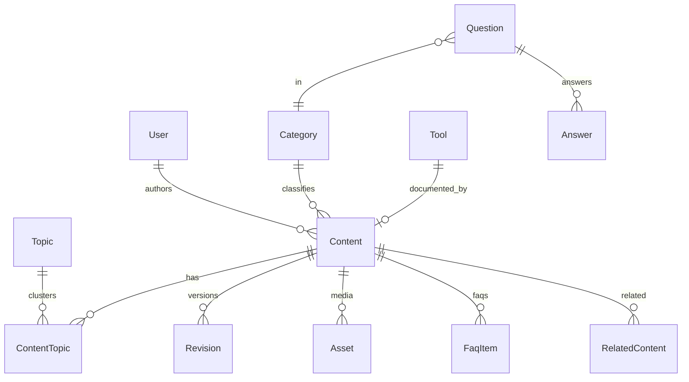

# 10 — Content Model

One conceptual model used by CMS, SEO, Search, Linking, Community, Analytics, Social.

There are **two families**:

1. **Editorial** — staff-controlled, default indexable after publish.
2. **UGC** — user-controlled, default **noindex** until Quality Gate.

---

## 1. Core entities

### Content (supertype)

| Field | Notes |
|---|---|
| id | UUID |
| type | article, guide, solution, news, trend, faq_page, comparison, opportunity, job, scholarship, tool_page, calendar_content, service_info, collection |
| title, slug, path | **path is the public URL; legacy paths are first-class** |
| locale | default `ar` |
| excerpt, body | body = structured blocks, not only HTML string |
| status | idea, draft, review, scheduled, published, unpublished, archived |
| published_at, updated_at, reviewed_at | |
| author_id | Organization allowed |
| category_id | |
| featured_asset_id | |
| seo_title, seo_description, canonical, robots, og | |
| schema_type | Article, WebApplication, FAQPage, … |
| indexable | computed + override |
| feature_flag | optional |
| ads_enabled | page-level |
| legacy_path | import trace |

### Type-specific

| Type | Extra |
|---|---|
| tool_page | tool_id, runtime, data_mode |
| calendar_content | calendar_system (umm_al_qura), timezone (`Asia/Riyadh`) |
| solution | problem_statement, steps[], tools[], prerequisites |
| comparison | items[], criteria[] |
| job / scholarship / opportunity | dates, geo, eligibility — later |
| trend | snapshot_date, sources[] |

### Tool

id, slug, path, name, engine_key (`hijri.convert`, `salary.next`, `gold.snapshot`, …), config JSON, sources[], disclaimer.

### FaqItem

question, answer, owned by Content or standalone. Can emit `FAQPage` if ≥2 items.

### Topic / Category / Tag

Category: nav + crumbs.  
Topic: cluster, used by linking engine.  
Tag: weak, noindex archives if < N indexable items.

### Source

label, url, accessed_at. Required for YMYL types.

### UGC entities (separate tables conceptually)

`Question`, `Answer`, `Comment`, `Vote`, `Bookmark`, `Follow`, `Report`, `UserProfile`.

UGC is **not** a `Content.type`. Mixing them in one table is allowed only if `origin = editorial | ugc` is mandatory and indexing rules key off `origin`.

**Preferred:** separate tables so SEO, ads, and permissions cannot leak.

---

## 2. Relationships

- Content ↔ Content: related (manual), parent/child (hub), canonical-of (rare).
- Content ↔ Tool: “uses tool” / “explained by”.
- Question ↔ Content: “asked about”.
- Content ↔ Topic: many-to-many with weight.

---

## 3. Metadata groups (every public document)

1. **Editorial:** title, H1 (may equal title), excerpt, body, dates, author.
2. **SEO:** title, description, canonical, robots, keywords (optional, low weight), breadcrumbs.
3. **Social:** og:title/description/image, twitter card.
4. **Schema:** JSON-LD graph list.
5. **Distribution:** share enabled, social-publish templates.
6. **Monetization:** ads on/off, slot profile.
7. **Quality:** word uniqueness score, source count, review state.

---

## 4. Lifecycle

See `41-content-lifecycle.md`. Status changes emit domain events (`content.published`, …) consumed by search, cache, social, analytics.

---

## 5. Mapping from legacy JSON

| Legacy | Entity |
|---|---|
| `articles.json` | Content type=article, origin=editorial |
| `core-guides.json` | blocks on the tool_page |
| `countdowns.json` | Tool + tool_page + FaqItem |
| `trending.json` topics | Content type=guide, path `/trending/:slug` |
| `SAUDI_EVENTS` | Event records + holiday pages |
| `SALARY_SCHEDULES` | Program + Tool config |
| `prices.json` | Snapshot, not content |
| i18n catalog articles | **do not import** until quality review |

---

## 6. Consistency contracts

- CMS cannot publish a type the SEO module cannot canonicalize.
- Search indexes the same `path` the sitemap emits.
- Social publisher reads the same title/excerpt/canonical.
- Internal linking uses Topic + embeddings-or-tokens of this model, not a parallel taxonomy.
