# 51 — Architecture Diagrams (Mermaid)

All diagrams are target-state unless labeled Legacy.

---

## 1. Legacy → New Platform Migration

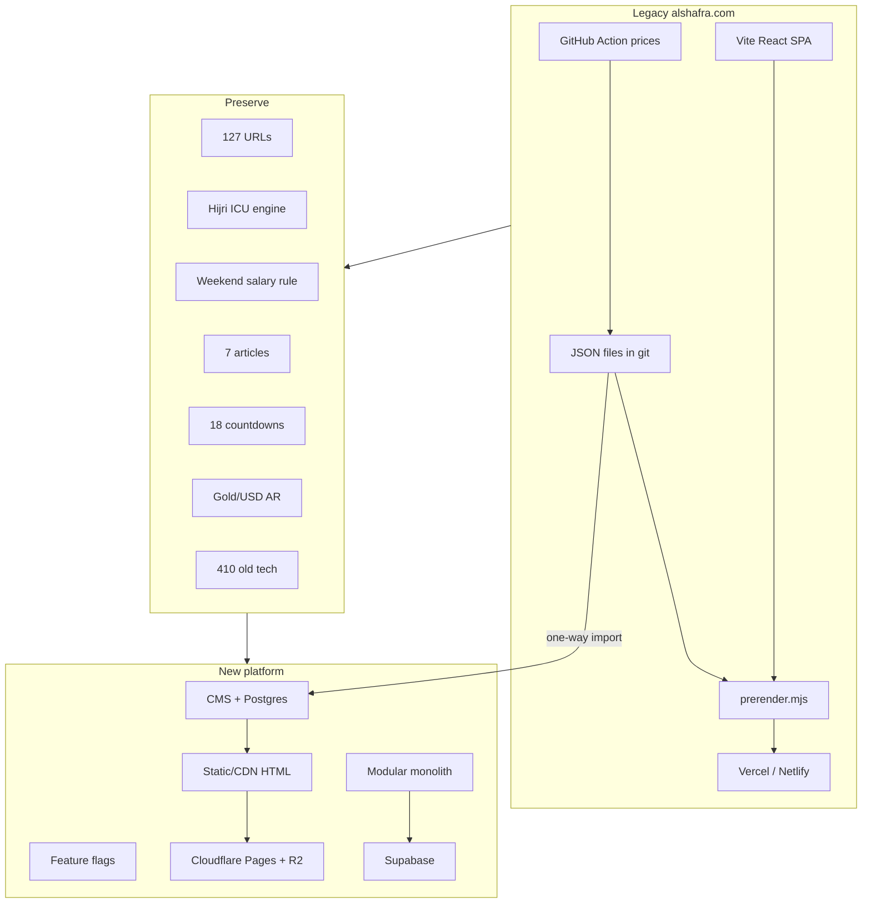

---

## 2. System Context

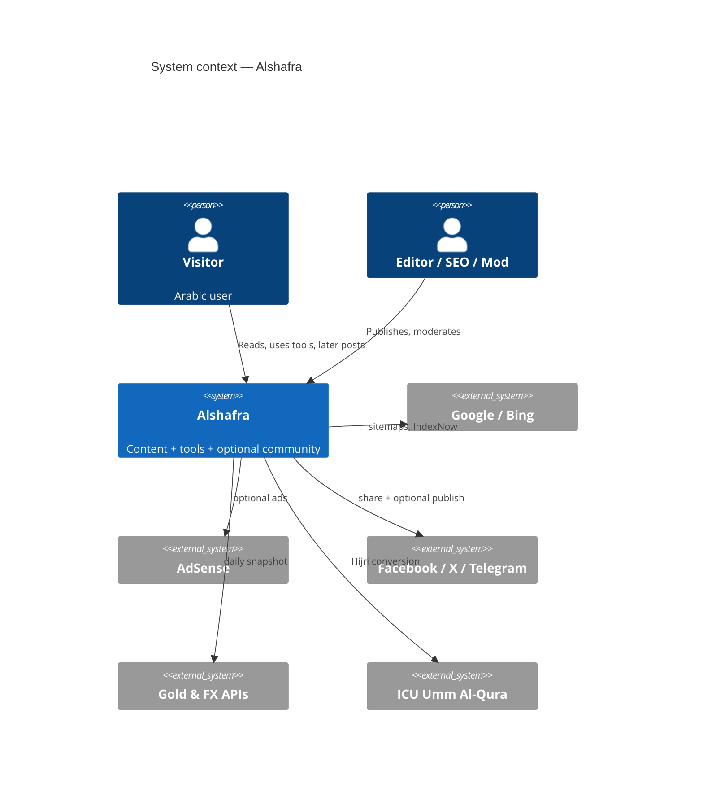

If C4 render fails, equivalent:

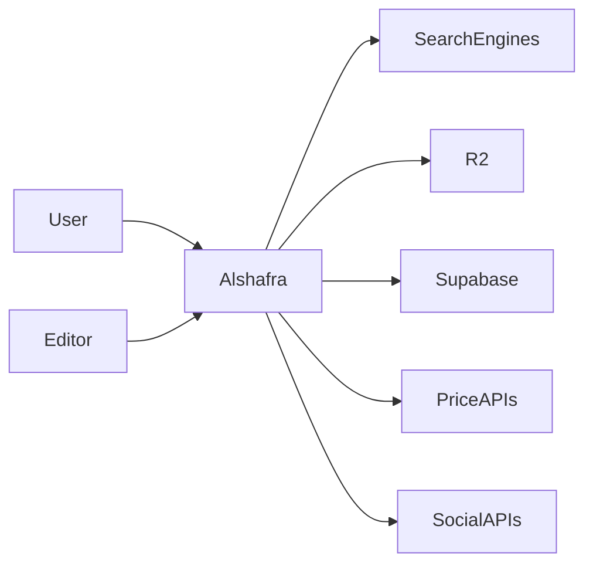

---

## 3. High-level Architecture

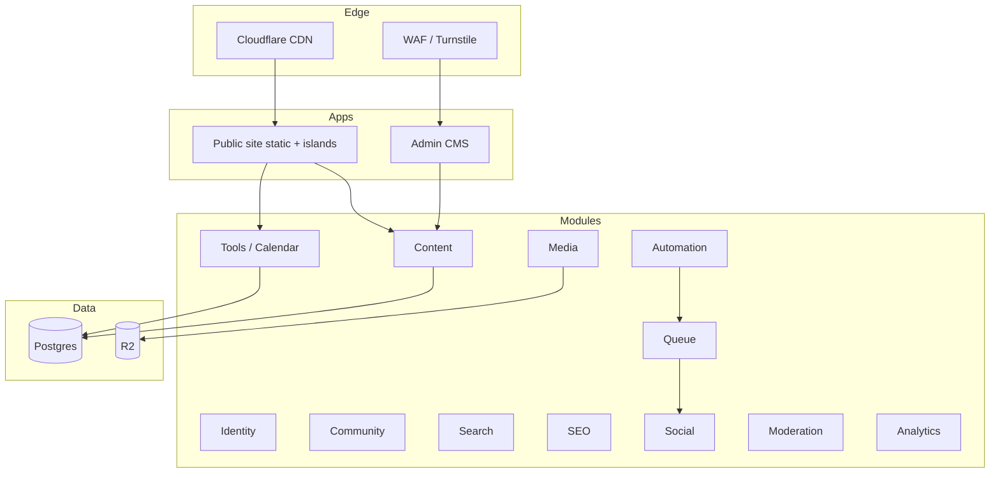

---

## 4. Content Flow

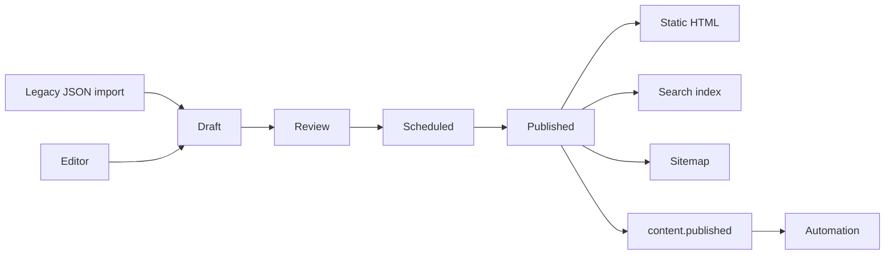

---

## 5. CMS Publishing Flow

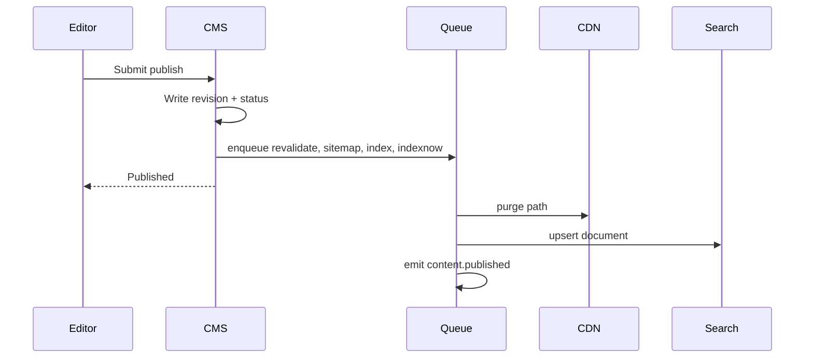

---

## 6. Social Publishing Flow

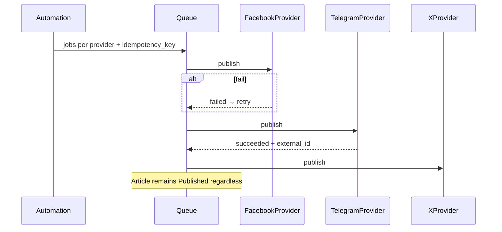

---

## 7. Automation Flow

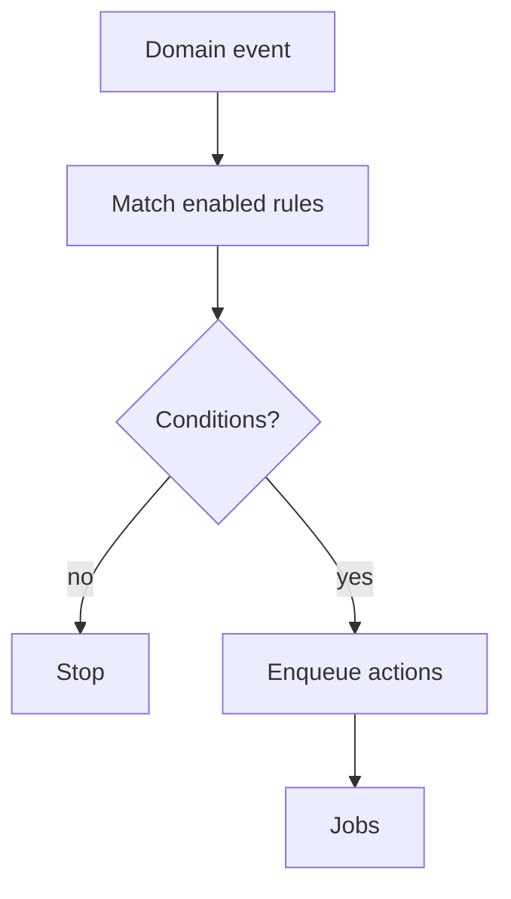

---

## 8. Community Flow

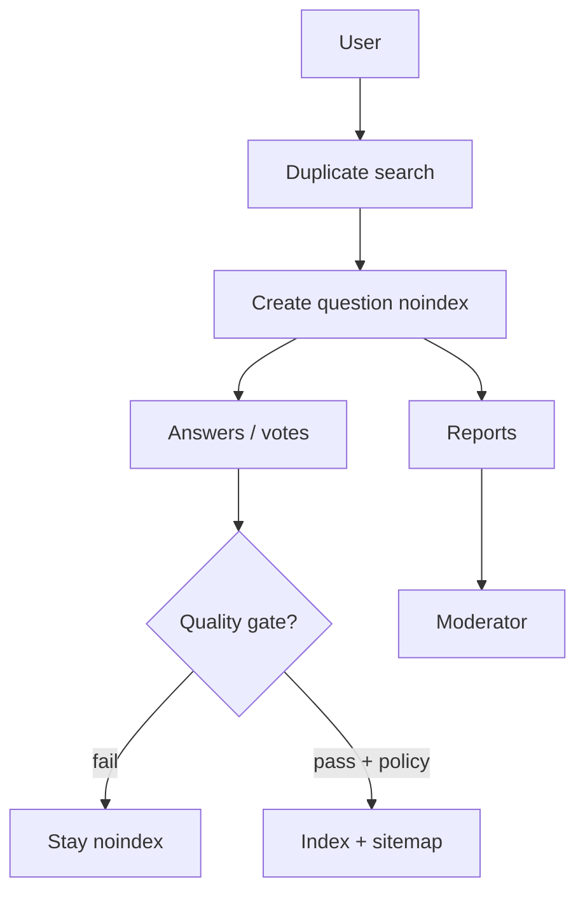

---

## 9. Authentication Flow

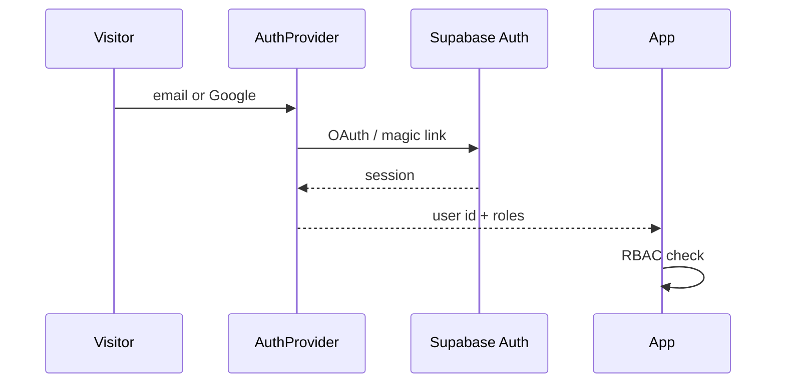

---

## 10. Media Flow

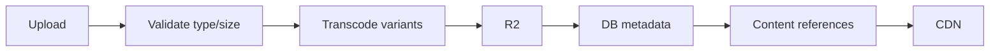

---

## 11. Search Flow

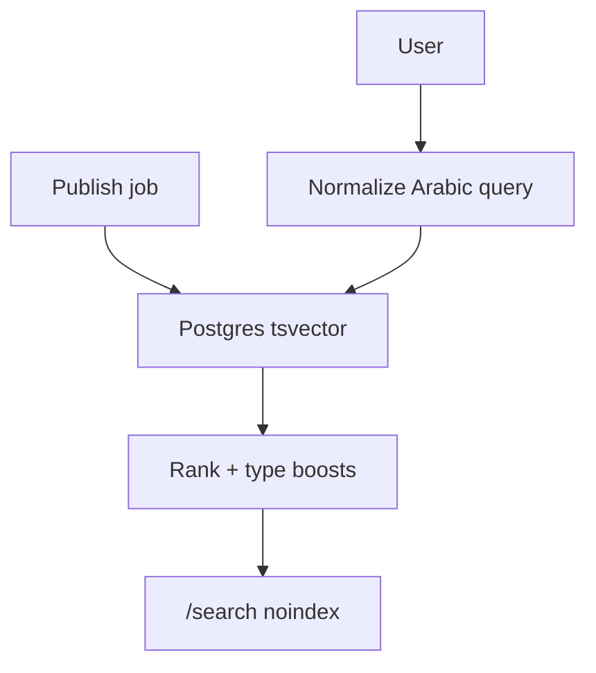

---

## 12. Analytics Flow

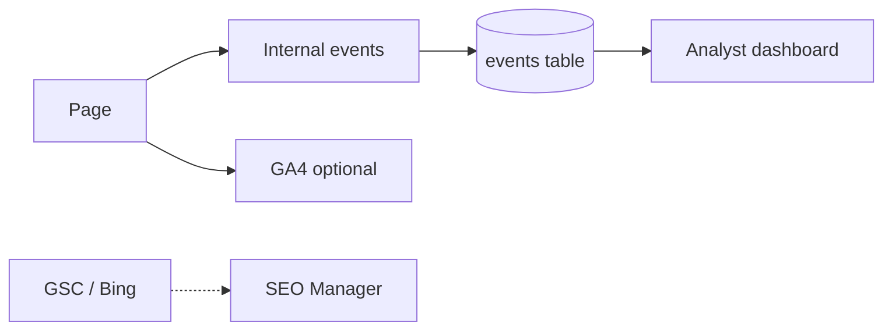

---

## 13. Notification Flow

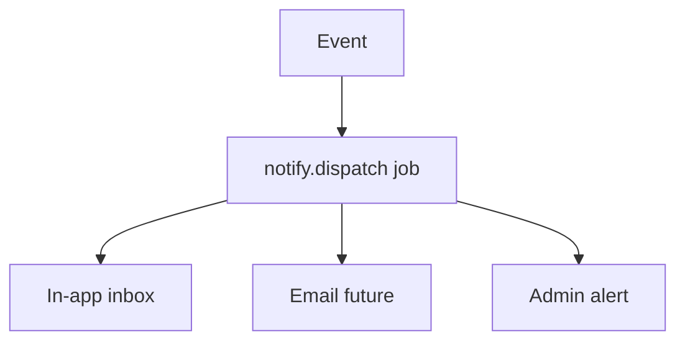

---

## 14. Feature Flag Flow

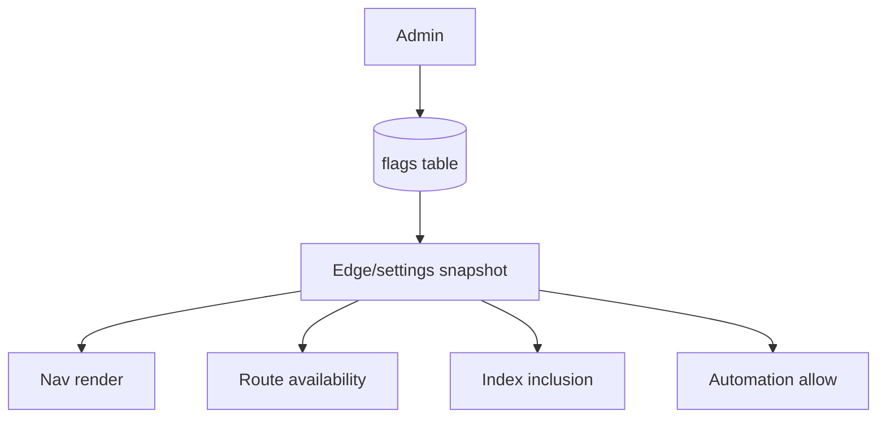
