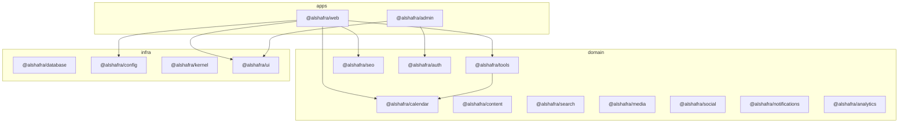

# 19 — Dependency Graph

No cycles. `ui` has no inbound domain deps. Packages currently have **zero** package-to-package imports except `tools` *may* import calendar later; today `tools` is data-only.

`apps/web` still contains page-level logic (legacy). New logic must not be added there if it belongs in a package.
