# 65 — Diagrams

## 1. System Architecture

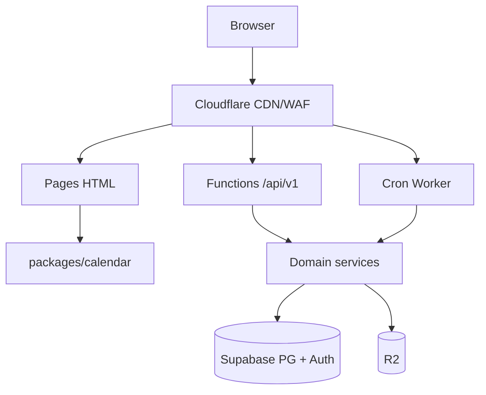

## 2. Module Boundaries

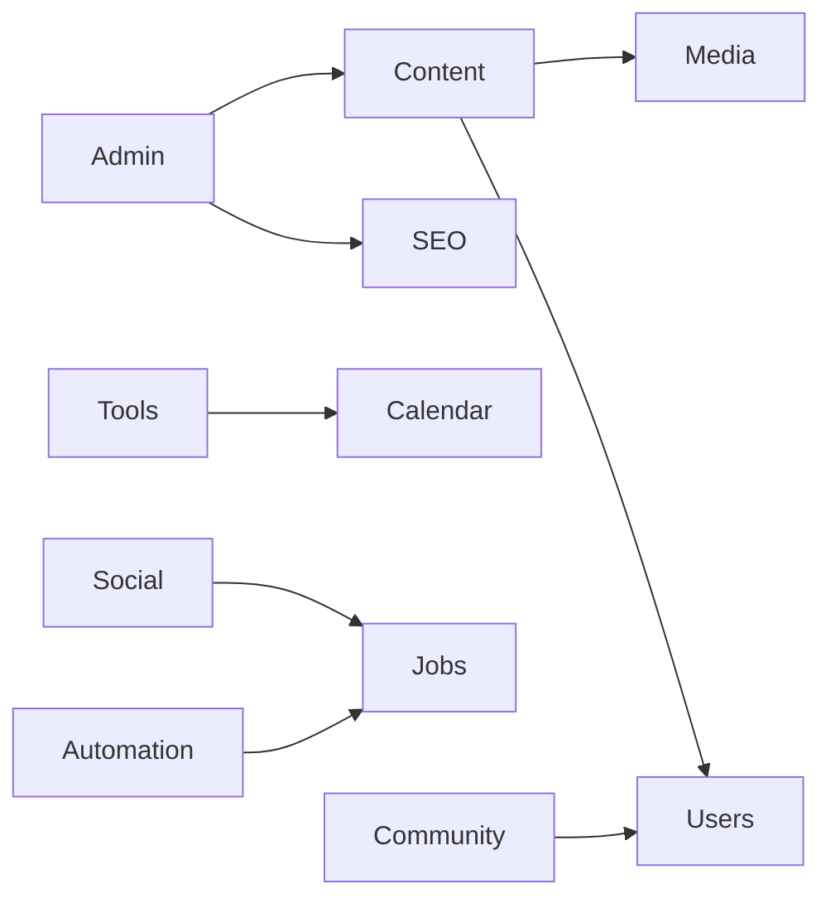

## 3. Database ERD (core)

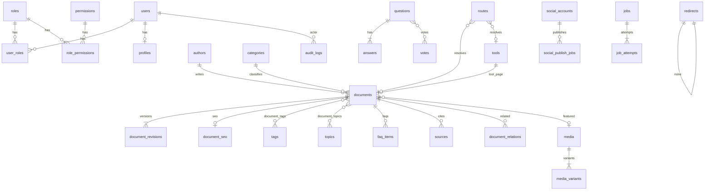

Cardinality notes: documents.path UNIQUE; routes.path UNIQUE; social_publish_jobs.idempotency_key UNIQUE; users.auth_user_id UNIQUE.

Indexes: see 06 (path, FTS GIN, jobs status/run_at).

## 4. Request Flow

```mermaid
sequenceDiagram
  participant B as Browser
  participant CF as Cloudflare
  participant R as Resolver
  participant A as Astro
  B->>CF: GET /date-converter
  CF->>R: normalize
  R-->>A: routes hit 200 tool
  A-->>B: HTML + island JS
```

## 5. Authentication

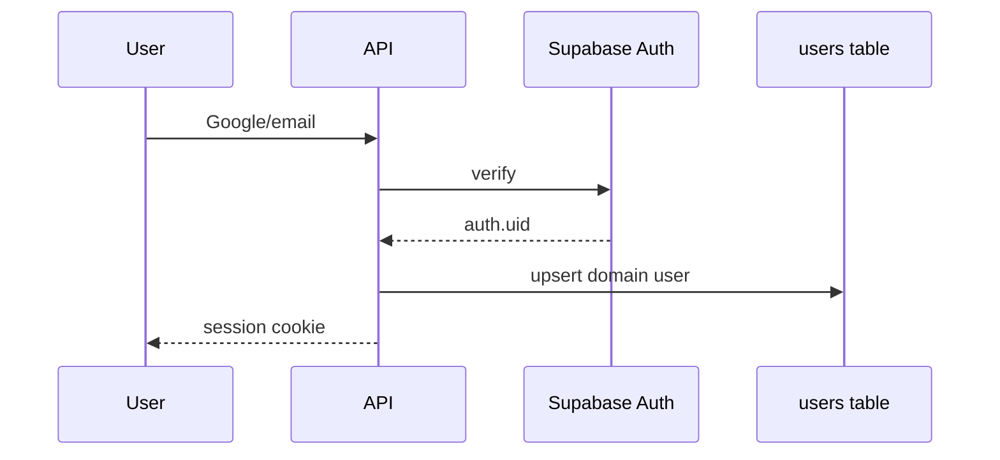

## 6. Authorization

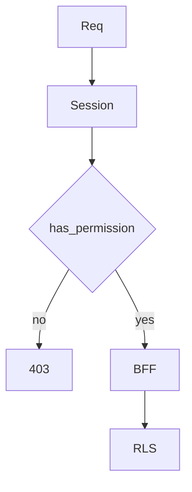

## 7. Content Publishing

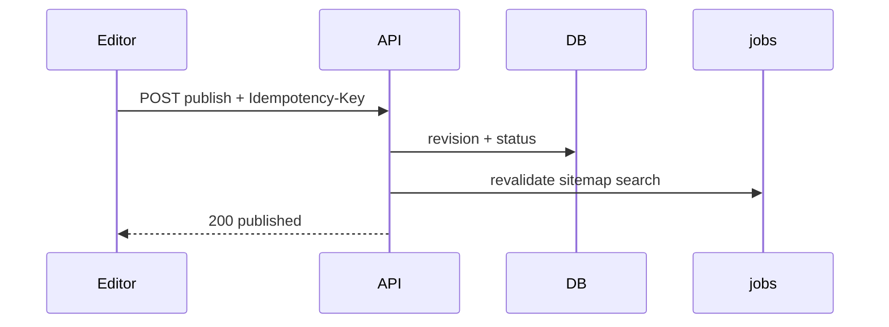

## 8. Legacy URL Resolution

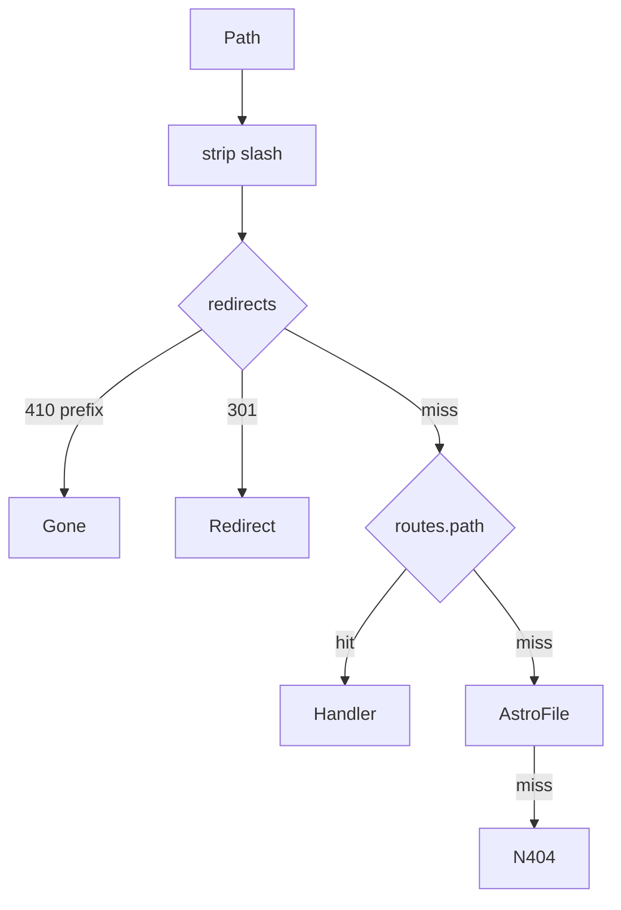

## 9. SEO Rendering

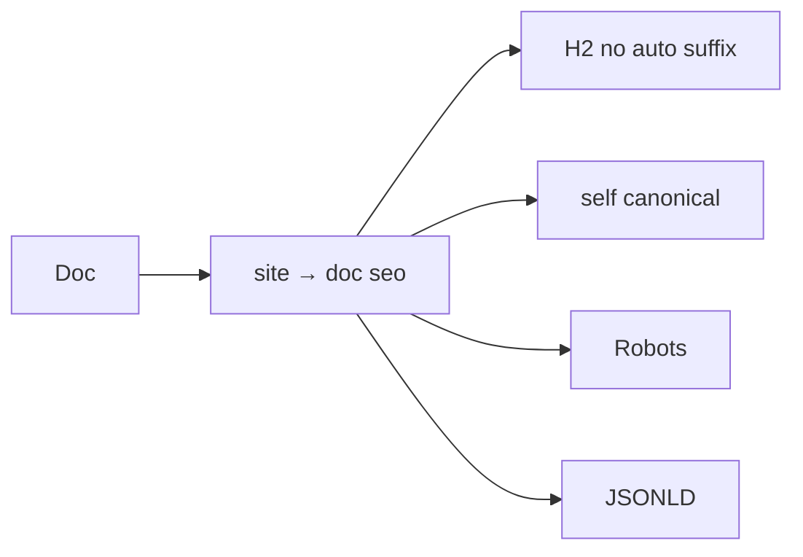

## 10. Search

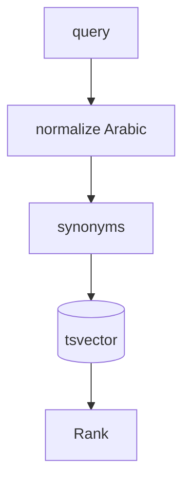

## 11. Media

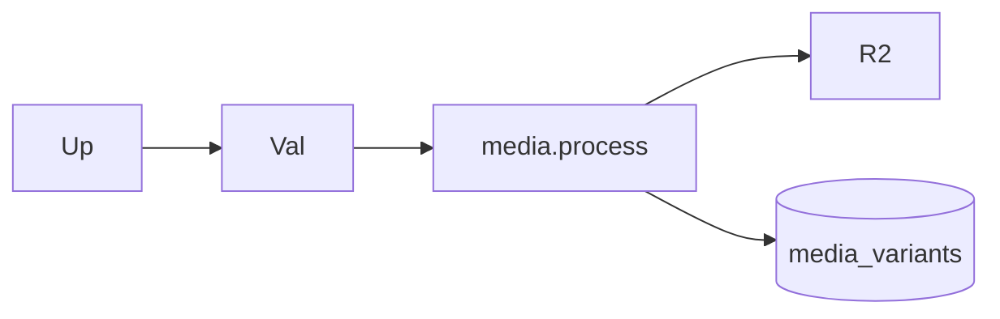

## 12. Community

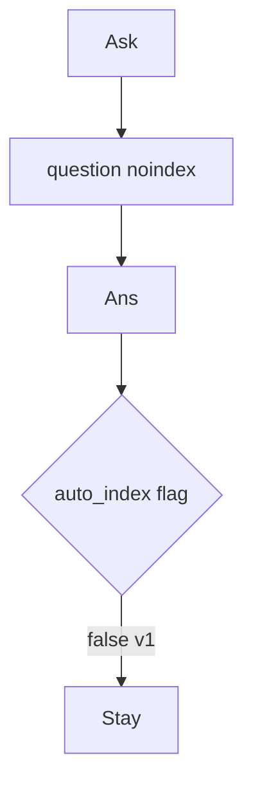

## 13. Social Publishing

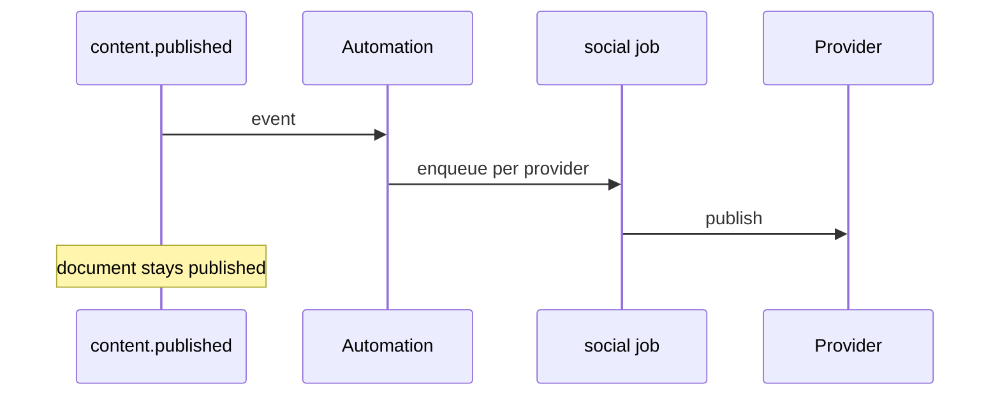

## 14. Automation

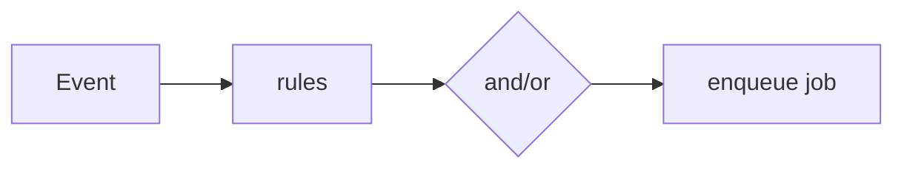

## 15. Job Queue

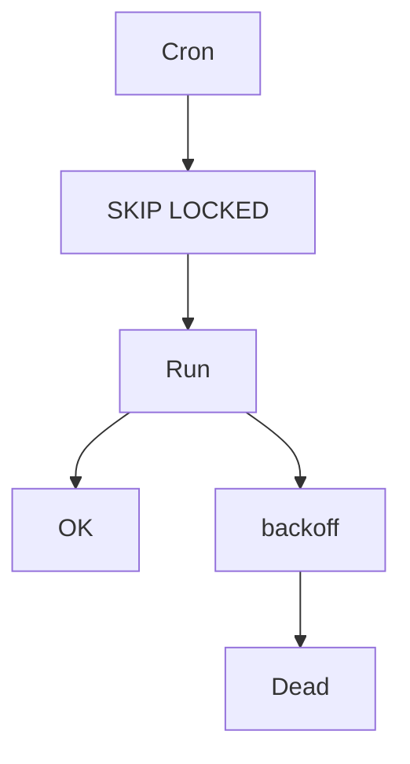

## 16. Feature Flags

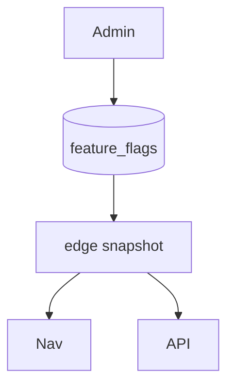

## 17. Analytics

```mermaid
flowchart LR
  Page --> Beacon[/public/events]
  Beacon --> EV[(analytics_events)]
  Page --> GA[GA4 optional]
```

## 18. Deployment

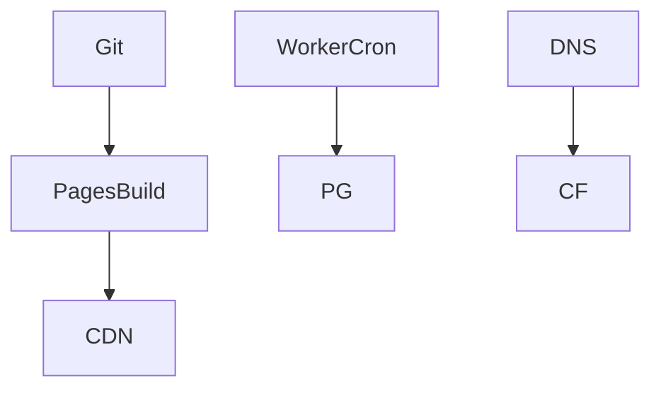
